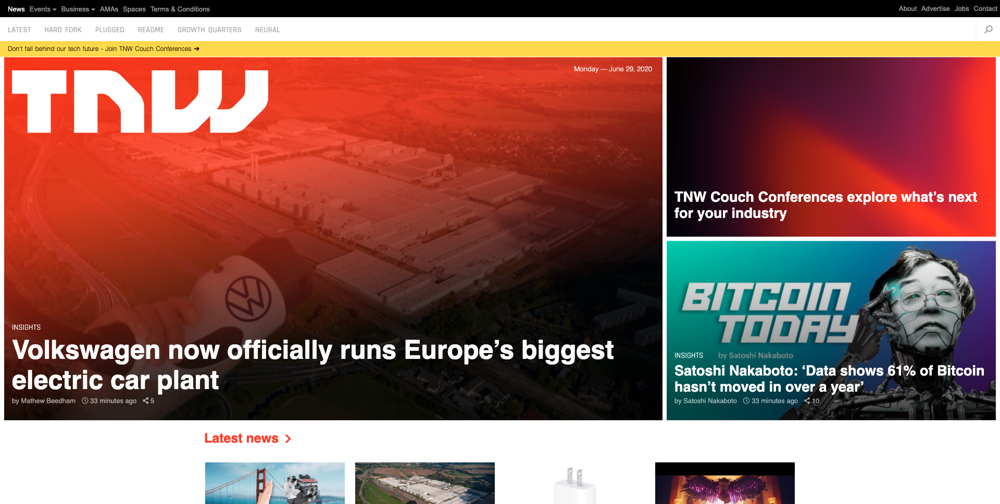
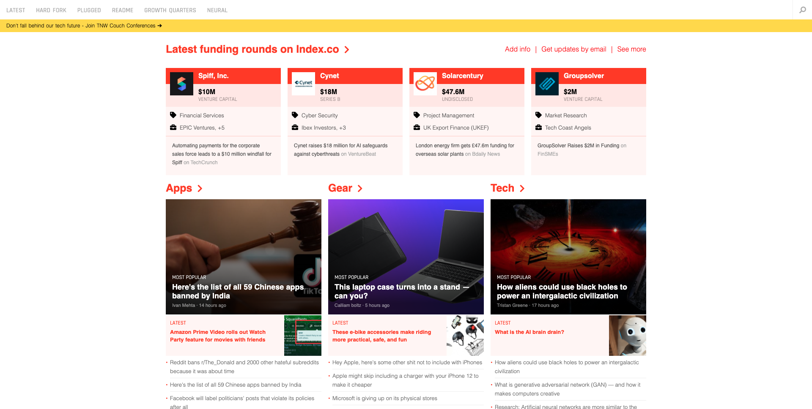
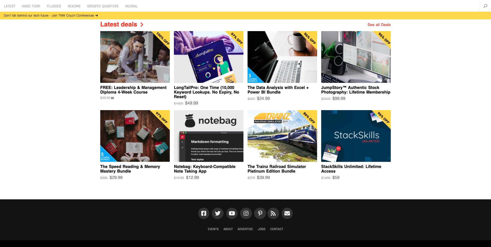

# The Next Web 

> For this project, we recreated The Next Web's website with fully responsive web design.

> This Microverse project allowed us to demonstrate the use of media queries to design webpages that adapt to different screen sizes.

Click [here](https://thenextweb.com/) to view The Next Web's website, which we used as a model for this project.

## Built With 🧰

- HTML
- CSS

## Live Demo 🔴

[Live Demo Link](https://livedemo.com)

## Getting Started 🏁

To get a local copy up and running on your own machine, just follow these simple steps:

### Prerequisites

If you are viewing this README.md file using a computer, a browser and a connection to the internet, then congratulations! You have all the prerequisites to access our project.

### Setup

1. Open Terminal
2. Navigate to your desired location to download the contents of this repository.
3. Copy and paste the following code into the Terminal: 
        
        git clone https://github.com/Joseph-Burke/The-Next-Web.git

4. Hit enter
5. Once the repository has been cloned, open index.html in a browser of your choosing.
6. Enjoy!

## Authors

👤 **Joe Burke**

- Github: [@Joseph-Burke](https://github.com/githubhandle)
- Twitter: [@__joeburke](https://twitter.com/__joeburke)
- Linkedin: [Joseph Burke](https://www.linkedin.com/in/joseph-burke-b7a8261a5)
- E-mail: joseph_burke@outlook.com

👤 **Ershadul Hakim Rayhan**

- Github: [@ershadul1](https://github.com/ershadul1)
- Twitter: [@ErshadulRayhan](https://twitter.com/ErshadulRayhan)
- Linkedin: [ErshadulRayhan](https://www.linkedin.com/in/ershadul-hakim-rayhan-a5a17649/)
- Email:  ershadul.rayhan@gmail.com

## 🤝 Contributing

The best contribution you can make is helping us improve our work by submitting an issue. 

## Show your support

Give a ⭐️ if you like this project!

## Acknowledgments

- [Microverse](https://www.microverse.org/)
- The Next Web - nice website!
- VSCode <3

## 📝 License

This project is [MIT](lic.url) licensed.
